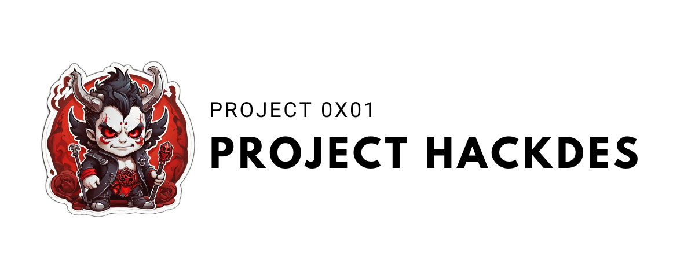

**Project description**

This project is nothing more than a docker/podman image that provides a range of tools specifically for the IT security field.

It is designed to be deployed a lot for use by students or Labs, for example (see Project [0x02-ProjectViper](https://github.com/TheHackdes/0x02---Project-Viper)).

## Table of contents

1. [Installation](#installation)
2. [Use](#use)
3. [Contribute](#contribute)
4. [License](#licence)

## Installation

To install it, simply make the script executable and run it as follows:

```bash
git clone https://github.com/TheHackdes/0x01---Project-Hades
cd 0x01---Project-Hades
docker build -f Dockerfile -t <NAME> .
```

## Use

Once the image is created you can use it in the following way:

```bash
docker run --rm -ti <NAME>
```

You will find there:

-Enumeration tools: `nmap`
-Productivity tools: `fzf`

## Usage
Once the image has been created, you can use it as follows:

```bash
docker run --rm -ti <NAME>
```

You'll find :

- Enumeration tools: `nmap`
- Productivity tools: `fzf`

## Contribute

As a reminder, this project is still only a draft, and as we are still in the process of creating this image, we welcome all contributions and opinions/improvements.

If you'd like to add a feature, please don't hesitate to :

1. Fork the project
2. Create a new branch (`git checkout -b feature/new-feature`)
3. Commit your changes (`git commit -am 'Add new feature'`)
4. Push the branch (`git push origin feature/new-feature`)
5. Create a pull request

## License

This project is distributed under the MIT License, a permissive open source license that allows anyone to use, modify and distribute the code, as long as the copyright notice and license are included in all copies or substantial parts of the software. This license is renowned for its simplicity and flexibility, offering great freedom to users.
